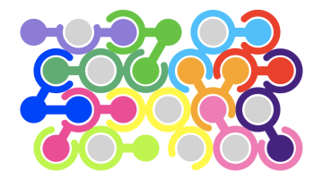

# Puzzle-Game
The objective is to place all twelve colored playing pieces
onto a board comprising 24 pegs which are arranged hexagonally.  The placement must
ensure that all of the pieces fit together correctly.

The game comprises **12 playing pieces**, each of which consists of three **units**.
The center unit (index = 1) is defined to be the **origin** of the piece (the placement of
the piece is defined in terms of the placement of the center unit).  A unit may
either be a **ball**, or a **ring**.  Each ball has one or two 
**connections** extending from it.  Each ring has zero, one, or two **openings**.
A ball and a ring may be placed on the same peg so long as the ball's *connection*
fits exactly in one of the ring's *openings*.  The units that form a piece are
numbered 0, 1 and 2, with 1 being the origin (the center unit), 0 being the 
unit to its left in the default ('A') orientation, and 2 being the remaining 
unit.

Each piece can be **flipped** and **rotated** at 60 degree increments, allowing
for 12 different **orientations** (six rotations and a flip). 

